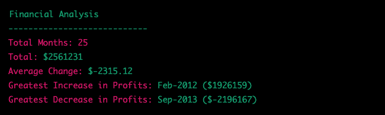

# Console-Finances

## Description
This project analyses a dataset of financial records to calculate various metrics. The dataset consists of arrays with two fields: a date and a profit/losses value.

The following metrics are calculated:
* Total number of months included in the dataset
* Net total amount of profit/losses over the entire period
* Average of the changes in profit/losses over the entire period
* Greatest increase in profits (date and amount) over the entire period
* Greatest decrease in losses (date and amount) over the entire period

The results are printed to the console in the following format:

## Use
To use this project, simply open the JavaScript file in a browser. The results will be printed to the console.

## Deployment

https://aloosli.github.io/Console-Finances/
